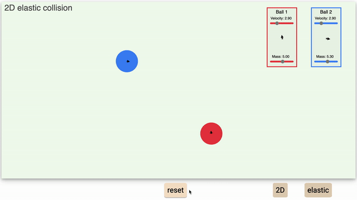
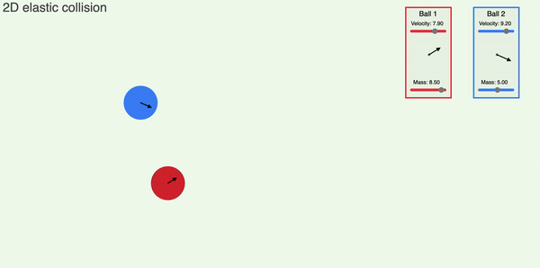

# Collision Simulator

### This is meant as an educational tool for physics students.

The hosted project can be found here: [Collision Simulator](https://tansonlee.github.io/collision-simulator/)

## Table of Contents

1. [Introduction](#introduction)
2. [Functionality and Controls](#functionality-and-controls)

## Introduction

As students who once took introductory physics classes, we thought a visualizer would be particularly useful for collisions. These can be counter-intuitive, so we thought that a simulator could help with this.

## Functionality and Controls

**Collision Type**

The collision can be any combination of 1D/2D and elastic/inelastic. The buttons at the bottom right let you toggle this.

**Controls**

The position and direction of the ball can be adjusted by dragging the ball and the ball control.
The display box allows you to change the speed and mass of the balls.